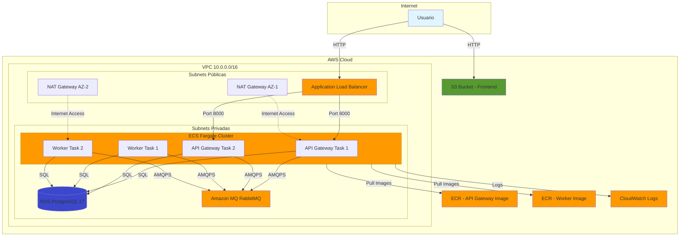
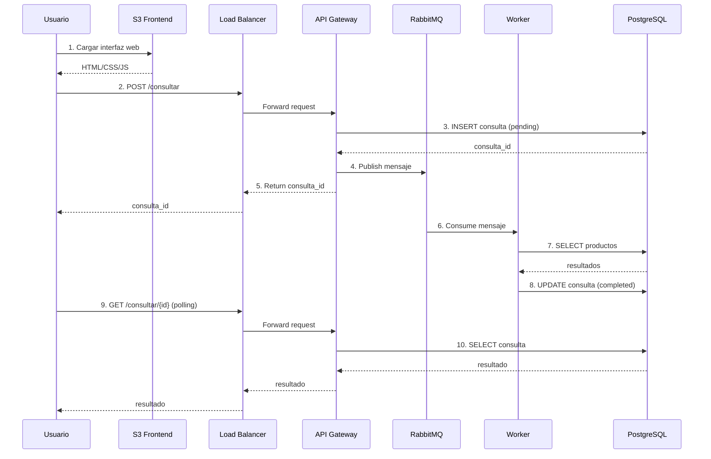

# Infraestructura AWS con Terraform

Este directorio contiene la configuración de Terraform para desplegar el sistema de escalabilidad en AWS.

## Arquitectura AWS



## Flujo de Datos



## Componentes de Infraestructura

### Networking
- **VPC**: Red privada virtual con CIDR 10.0.0.0/16
- **Subnets Públicas**: 2 subnets en diferentes AZs (para ALB y NAT Gateways)
- **Subnets Privadas**: 2 subnets en diferentes AZs (para ECS, RDS, MQ)
- **Internet Gateway**: Acceso a Internet para recursos públicos
- **NAT Gateways**: Salida a Internet para recursos privados (2 para alta disponibilidad)

### Compute
- **ECS Fargate Cluster**: Orquestación de contenedores serverless
- **API Gateway Service**: 2 tareas (escalable)
- **Worker Service**: 2 tareas (escalable)
- **ECR**: Repositorios para imágenes Docker

### Data
- **RDS PostgreSQL 17**: Base de datos relacional (db.t3.micro)
- **Amazon MQ (RabbitMQ 3.13)**: Message broker (mq.t3.micro)

### Storage & Frontend
- **S3**: Hosting estático del frontend
- **S3 Website**: Configuración para servir SPA

### Monitoring
- **CloudWatch Logs**: Logs centralizados de ECS tasks
- **ECS Container Insights**: Métricas del cluster

### Security
- Security Groups para:
  - ALB (HTTP/HTTPS)
  - API Gateway (puerto 8000 desde ALB)
  - Worker (sin ingress, solo egress)
  - RDS (puerto 5432 desde API/Worker)
  - RabbitMQ (puerto 5671 desde API/Worker)

## Requisitos Previos

1. **AWS CLI** configurado con credenciales
2. **Terraform** >= 1.0
3. **Docker** para construir imágenes
4. Cuenta de AWS con permisos adecuados

## Variables Requeridas

Crear archivo `terraform.tfvars`:

```hcl
aws_region          = "us-east-1"
environment         = "dev"
db_password         = "tu-password-seguro"
rabbitmq_password   = "tu-password-seguro"
```

## Despliegue

### 1. Construir y Pushear Imágenes Docker

```bash
# Obtener URL de login ECR
aws ecr get-login-password --region us-east-1 | docker login --username AWS --password-stdin <account-id>.dkr.ecr.us-east-1.amazonaws.com

# Construir imágenes
cd ../api-gateway
docker build -t escalabilidad/api-gateway:latest .

cd ../worker
docker build -t escalabilidad/worker:latest .

# Tag y push (después de terraform apply para crear ECR)
docker tag escalabilidad/api-gateway:latest <ecr-api-gateway-url>:latest
docker push <ecr-api-gateway-url>:latest

docker tag escalabilidad/worker:latest <ecr-worker-url>:latest
docker push <ecr-worker-url>:latest
```

### 2. Inicializar Terraform

```bash
cd terraform
terraform init
```

### 3. Planificar Cambios

```bash
terraform plan
```

### 4. Aplicar Infraestructura

```bash
terraform apply
```

El despliegue completo toma aproximadamente 15-20 minutos.

### 5. Subir Frontend a S3

```bash
# Obtener nombre del bucket de los outputs
BUCKET_NAME=$(terraform output -raw frontend_bucket_name)

# Subir archivos
aws s3 sync ../frontend/ s3://$BUCKET_NAME/ \
  --exclude "*.md" \
  --exclude ".git*"
```

### 6. Inicializar Base de Datos

Conectarse a la base de datos y ejecutar el script `database/init.sql`:

```bash
# Obtener endpoint de RDS
RDS_ENDPOINT=$(terraform output -raw rds_endpoint)

# Conectar usando psql (requiere tener psql instalado)
psql -h $RDS_ENDPOINT -U escalabilidad_user -d escalabilidad_db -f ../database/init.sql
```

## Acceso a la Aplicación

Después del despliegue, obtener las URLs:

```bash
# URL del API Gateway
terraform output alb_url

# URL del Frontend
terraform output frontend_url

# Console de RabbitMQ
terraform output rabbitmq_console_url
```

## Escalado

### Escalar API Gateway

```bash
terraform apply -var="api_gateway_desired_count=4"
```

### Escalar Workers

```bash
terraform apply -var="worker_desired_count=5"
```

## Monitoreo

### CloudWatch Logs

```bash
# Ver logs del API Gateway
aws logs tail /ecs/escalabilidad/api-gateway --follow

# Ver logs del Worker
aws logs tail /ecs/escalabilidad/worker --follow
```

### ECS Tasks

```bash
# Listar tareas en ejecución
aws ecs list-tasks --cluster escalabilidad-cluster

# Describir una tarea
aws ecs describe-tasks --cluster escalabilidad-cluster --tasks <task-arn>
```

## Costos Estimados (us-east-1)

| Servicio | Configuración | Costo Mensual Aprox. |
|----------|--------------|----------------------|
| RDS PostgreSQL | db.t3.micro | $15 |
| Amazon MQ | mq.t3.micro | $18 |
| ECS Fargate API | 2 tasks (0.25 vCPU, 0.5 GB) | $15 |
| ECS Fargate Worker | 2 tasks (0.25 vCPU, 0.5 GB) | $15 |
| ALB | 1 instancia | $16 |
| NAT Gateway | 2 instancias | $65 |
| S3 | Negligible | $1 |
| **TOTAL** | | **~$145/mes** |

## Limpieza

Para destruir toda la infraestructura:

```bash
# Primero vaciar el bucket S3
BUCKET_NAME=$(terraform output -raw frontend_bucket_name)
aws s3 rm s3://$BUCKET_NAME/ --recursive

# Destruir infraestructura
terraform destroy
```

## Troubleshooting

### Tasks no inician

1. Verificar logs en CloudWatch
2. Verificar que las imágenes existen en ECR
3. Verificar security groups

### RDS no accesible

1. Verificar que está en subnet privada
2. Verificar security group permite conexiones desde ECS tasks

### RabbitMQ no conecta

1. Verificar endpoints en Amazon MQ console
2. Verificar credenciales
3. Amazon MQ usa TLS por defecto (amqps://)

## Recursos Creados

- 1 VPC
- 4 Subnets (2 públicas, 2 privadas)
- 2 NAT Gateways
- 1 Internet Gateway
- 5 Security Groups
- 1 Application Load Balancer
- 1 RDS PostgreSQL
- 1 Amazon MQ RabbitMQ
- 1 ECS Cluster
- 2 ECS Services
- 2 ECR Repositories
- 1 S3 Bucket
- 2 CloudWatch Log Groups
- IAM Roles y Policies
